# Google Data Analytics Professional Certificate Capstone Project

---
Title: "Case Study - Cyclistic"  
Author: "Eric Weichao Huang"  
Date: "2022/12/15"  
Output: html_document  
---

## SUMMARY

This case study was completed by Eric Weichao Huang in December 2022 as part of the Google Data Analytics Professional Certificate capstone Project for my portfolio.   

## CASE STUDY BRIEF

### Scenario

You are a junior data analyst working in the marketing analyst team at Cyclistic, a bike-share company in Chicago. The director of marketing believes the company’s future success depends on **maximizing the number of annual memberships**. Therefore, your team wants to understand **how casual riders and annual members use Cyclistic bikes differently**.  
From these insights, your team will design a new marketing strategy to convert casual riders into annual members.  
But first, Cyclistic executives must approve your recommendations, so they must be backed up with compelling data insights and professional data visualizations.

### Characters and teams

* **Cyclistic**: A bike-share program that features more than 5,800 bicycles and 600 docking stations. Cyclistic sets itself apart by also offering reclining bikes, hand tricycles, and cargo bikes, making bike-share more inclusive to people with disabilities and riders who can’t use a standard two-wheeled bike. The majority of riders opt for traditional bikes; about 8% of riders use the assistive options. Cyclistic users are more likely to ride for leisure, but about 30% use them to commute to work each day.
* **Lily Moreno**: The director of marketing and your manager. Moreno is responsible for the development of campaigns
and initiatives to promote the bike-share program. These may include email, social media, and other channels.
* **Cyclistic marketing analytics team**: A team of data analysts who are responsible for collecting, analyzing, and
reporting data that helps guide Cyclistic marketing strategy. You joined this team six months ago and have been busy
learning about Cyclistic’s mission and business goals — as well as how you, as a junior data analyst, can help Cyclistic achieve them.
* **Cyclistic executive team**: The notoriously detail-oriented executive team will decide whether to approve the
recommended marketing program.

### About the company

In 2016, Cyclistic launched a successful bike-share offering. Since then, the program has grown to a fleet of 5,824 bicycles that are geotracked and locked into a network of 692 stations across Chicago. The bikes can be unlocked from one station and returned to any other station in the system anytime.   
Until now, Cyclistic’s marketing strategy relied on building general awareness and appealing to broad consumer segments. 
One approach that helped make these things possible was the flexibility of its pricing plans: single-ride passes, full-day passes, and annual memberships. Customers who purchase single-ride or full-day passes are referred to as casual riders. Customers who purchase annual memberships are Cyclistic members.  
Cyclistic’s finance analysts have concluded that annual members are much more profitable than casual riders. Although the pricing flexibility helps Cyclistic attract more customers, Moreno believes that maximizing the number of annual members will be key to future growth. Rather than creating a marketing campaign that targets all-new customers, Moreno believes there is a very good chance to convert casual riders into members. She notes that casual riders are already aware of the Cyclistic program and have chosen Cyclistic for their mobility needs.  
Moreno has set a clear **goal: Design marketing strategies aimed at converting casual riders into annual members.** In order to do that, however, the marketing analyst team needs to better understand how annual members and casual riders differ, why casual riders would buy a membership, and how digital media could affect their marketing tactics. Moreno and her team are interested in analyzing the Cyclistic historical bike trip data to identify trends.

## 6 Phases

### 1. Ask

* **Business Task**:  
To find out how annual members and casual riders use Cyclistic bikes differently to support the decision of convert casual riders into annual members to maximize profits.

* **Data Source**:  
I used the previous 12 monthly data files from 202112 to 202211.

### 2. Prepare

**ROCCC**:  
As these data files are company internal files, they are considered **Reliable**, **Original**, and **Cited**. After quick examination of the data file, the data is **comprehensive**. I used all the monthly files 12 months from now, so it is also **Current**.

I downloaded the original data files to my computer. I Created two folders for the data, one for original download and the other for working. I started with playing one of the monthly file as the size is smaller. After cleaning the data, I combined all 12 monthly csv files into 1 big merged csv file and imported to both SQL Server and Power BI for further analysis.

### 3. Process

Tools used:

* **Excel**: for the first look of each monthly CSV report. 
* **Microsoft SQL Server Management Studio**: for deeper examination of the data, such as, finding outliers, wrong data, quick calculation for min, mean, and max of the measure.  
I ran SQL script to check and removed records that have ended time earlier than started time. Also, I found a total of 854,841 records don’t have start_station_id/name and 915,080 records missing end_station_id/name and a total of 1,323,120 records that missing either information. I deleted these incomplete information. But one interesting thing to notice is that all the data missing start_station_id/name belongs to Ride_Type electric_bike. Maybe the company can fix this problem in the future. 
* **RStudio**: for plotting on single month report, it is a good choice. And I used RStudio for my R Markdown file for this final report.
* **Power BI**: As I'm more used to with Power BI and the total size of the dataset was considerably big, Power BI worked better for me and it allows me to clean the data by filtering out the incomplete data.
I used Power BI to filter out the records that contains blank start or end station id/names. 
I added a few new columns, such as, DayOfWeek, DayNumOfWeek, HourOfDay, RideLengthMin, and RideLengthSec to help with further analysis.
* **Kaggle**: for posting and sharing my final report.

### 4. Analyze

I added new columns DayOfWeek and HourOfDay to plot the relationship between number of rides and day of the week/hour of the day to see how the trend for usage might be different for annual member and casual riders. The column DayNumOfWeek is used to order the days of the week in chronological order rather than alphabetical order.

I added ride length column to see the behavioral difference for annual members and casual riders.

### 5. Share

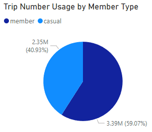 

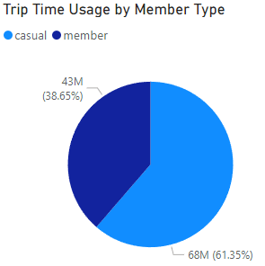 

 
According to figure 4.01 and 4.02, 40.93% of total rides from casual riders occupied 61.35% of total capacity from all the bikes.

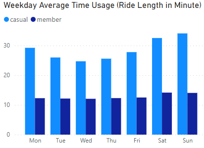 

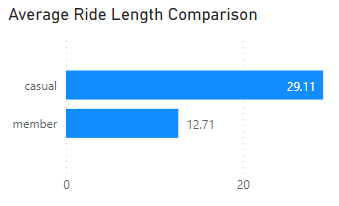 

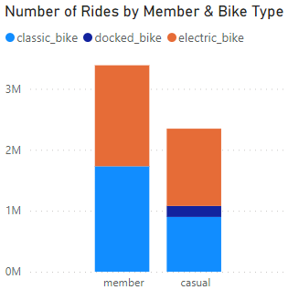 

 
According to figure 4.05, there was no single usage of docked bike by annual members. I suspect there is missing or wrong data here. Otherwise, it appears that annual members either don't like docked bikes or the future locations of docked bikes might needs to pay more attention to annual members.

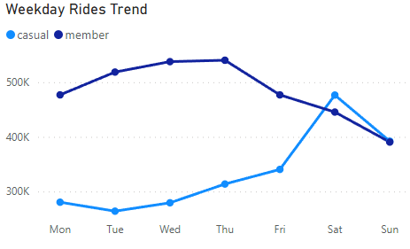 

 
According to figure 4.06, The Weekday Rides Trend shows that members tend to ride more during the weekdays and casual riders prefers the weekend. The number of rides from casual riders even surplussed annual members on Saturday. 

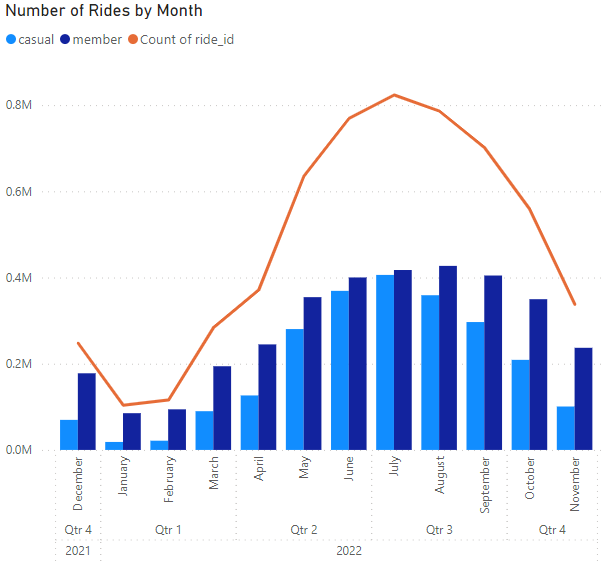 

 
According to figure 4.07, people tend to use bike-share service less in the winter season. It is believed that temperature and bad road condition are the reasons behind.

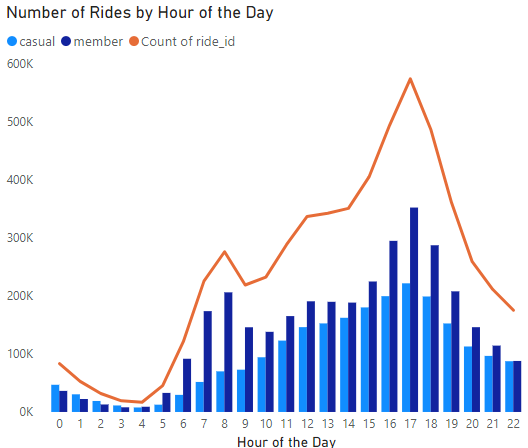 

 
According to figure 4.08, the number of rides raise quickly in the morning between 7am and 9am. The number of rides raise quickly after 11am for both casual riders and annual members and peaked between 4pm and 7pm. The number of rides died down after mid night until 6am the next day.

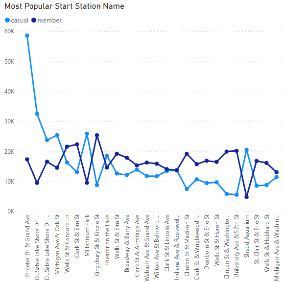 

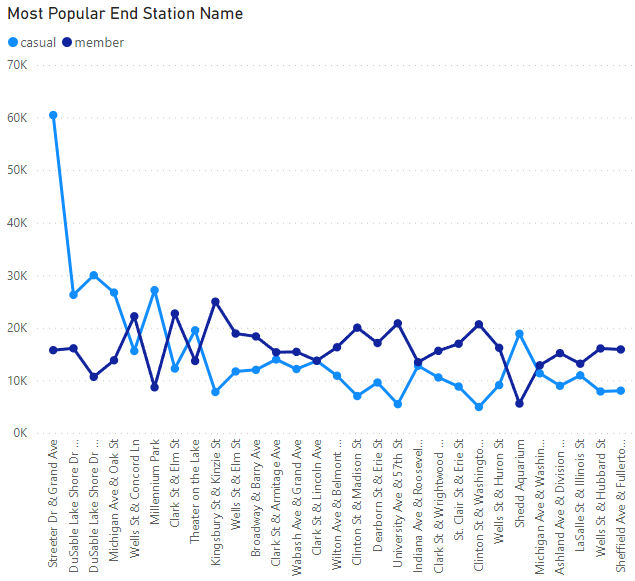 

 
According to figure 4.09 and 4.19, the most popular start and end stations are somewhat close. The top 5 locations are all located alongside the navy pier area, which is heavily populated for both business and recreation purpose. That makes these locations ideal for future marketing campaign.

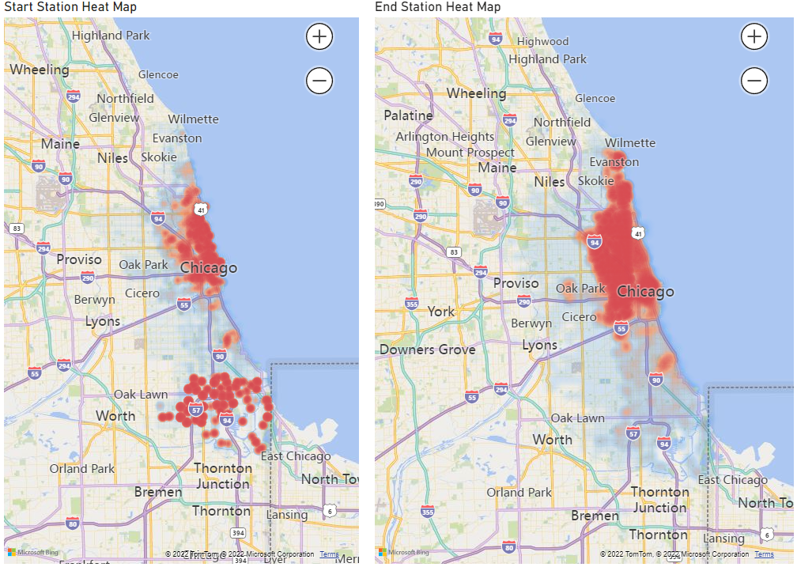 

 
According to the head maps showed side-by-side in figure 4.11, the most popular start stations scatter between the harbor area in downtown Chicago and big Chicago State University area, while the most popular end stations are densely located along side the harbor downtown area. Given the fact that the number of available bikes are limited, the company might want to consider transporting some of the bikes from the harbor area in the low business hour (from 1am to 5am according to figure 4.08) to big Chicago State University area to increase investment/profit ratio.

The visualization that I’m most proud of are the Weekday Rides Trend and the heat map comparing the start and end station. The Weekday Rides Trend shows that members tend to ride more during the weekdays and casual riders prefers the weekend. Also I need to dig a little deeper to convert the date time into weekdays and sort them using number to avoid sorting the name alphabetically. The heat map shows that the start and end stations are tremendously. When we plan to launch marketing campaigns, it would help a lot to target on the most related casual riders.

### 6. Act

As a junior data analyst, I would prepare a power point presentation to show my finds to my boss, Lily Moreno. With her help, I believe I can improve my findings and dig deeper for more fundamental factors to support the business task.

